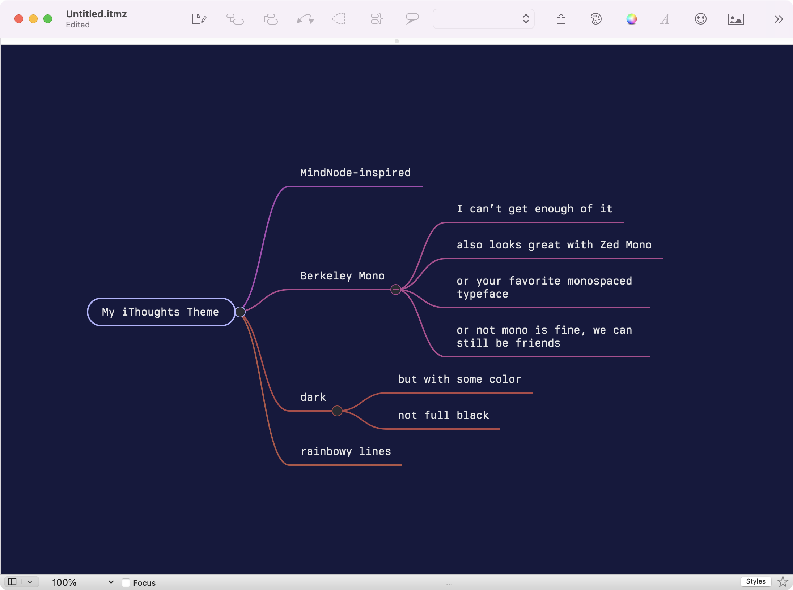
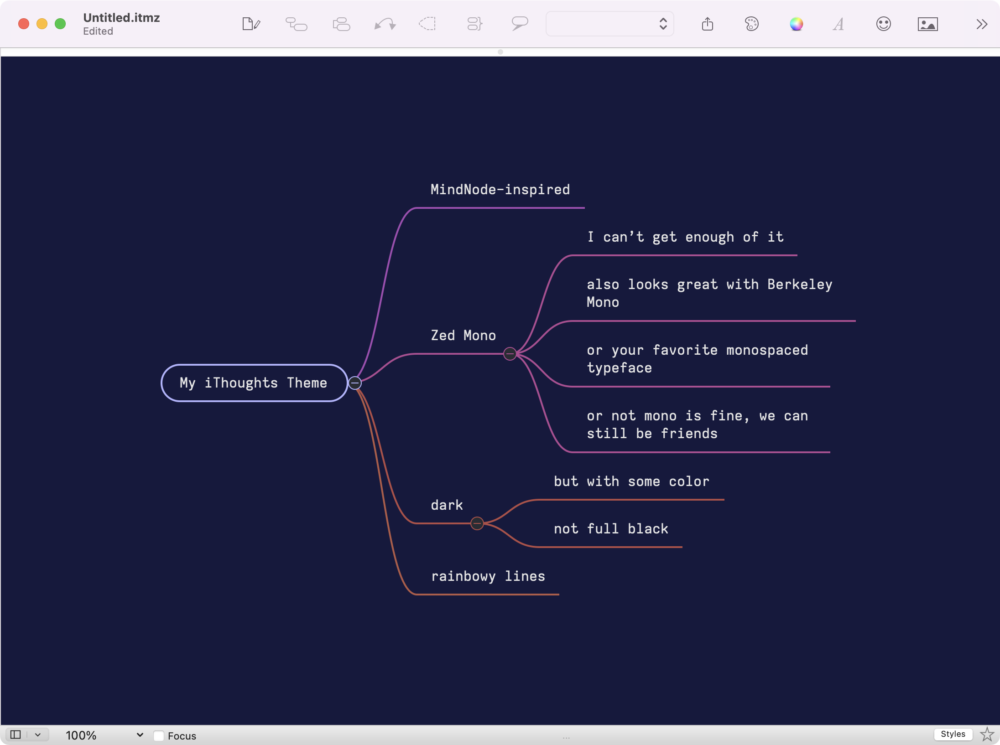
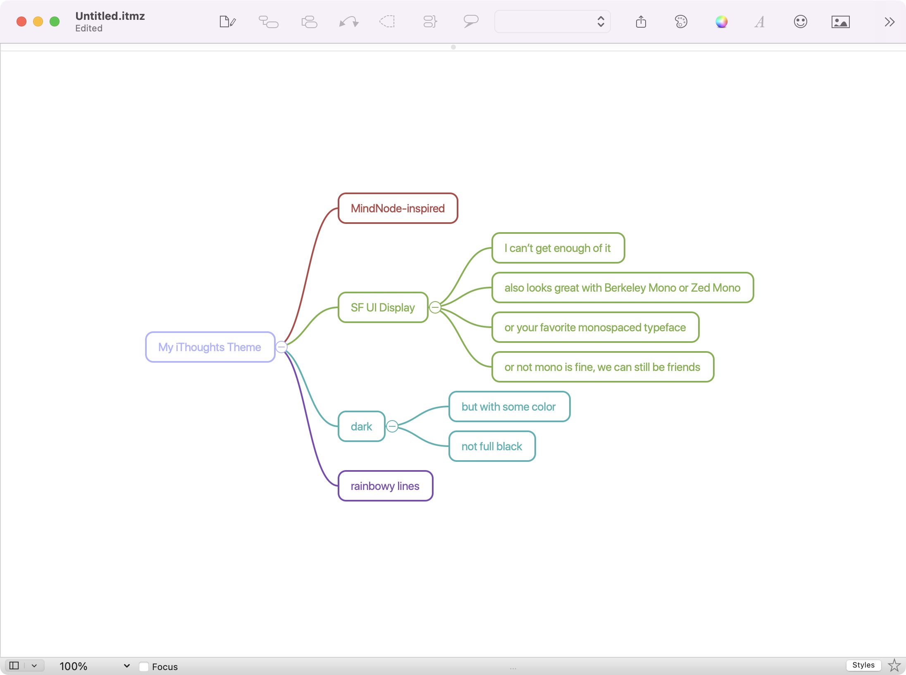

# iThoughtsX Themes

These are the themes I’ve been using with [iThoughtsX](https://www.toketaware.com/ithoughts-osx), each of which is a lightly-adjusted variation of @flegfleg’s [compact-ithoughtsx-theme](https://github.com/flegfleg/compact-ithoughtsx-theme) collection.

## compact-dark-berkeley

Using [Berkeley Mono](https://berkeleygraphics.com/typefaces/berkeley-mono/), my current obsession.

## compact-dark-zed

Using [Zed Mono](https://github.com/zed-industries/zed-fonts), my previous obsession:

## compact-light-sf-ui

Using [SF UI](https://developer.apple.com/fonts/) in light mode, just in case the dark starts to feel too heavy:

